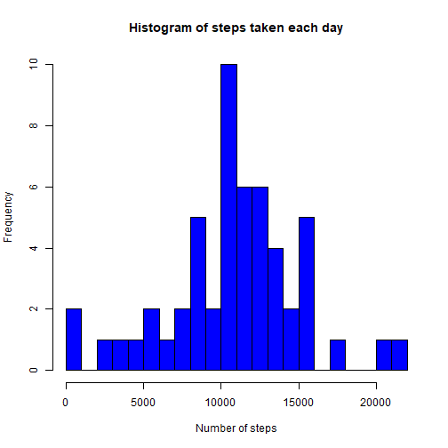
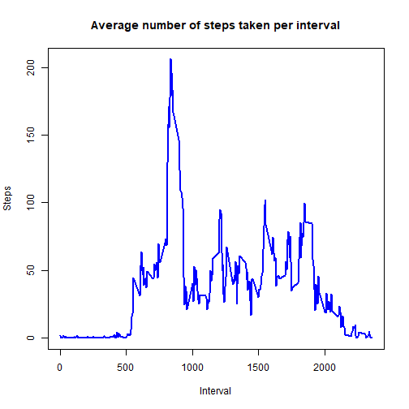
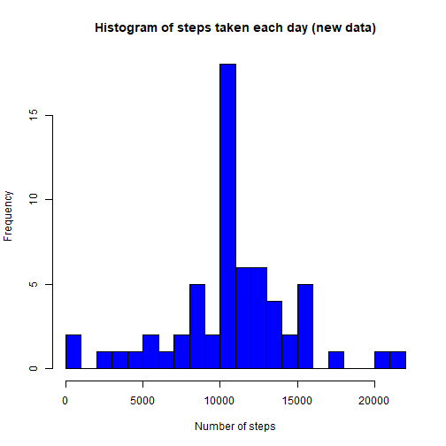
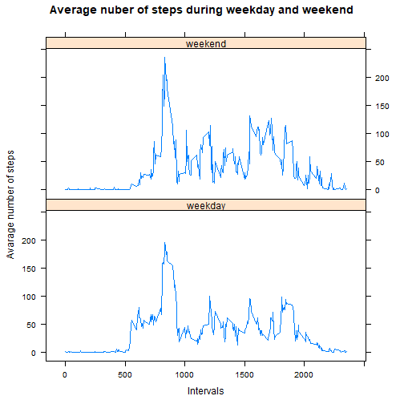

Reproducible Research Course Project 1
======================================

## Preparing the data

First of all I'm going to load the data and look at the first columns to check 
the data.


```r
## loading data
data <- read.csv("activity.csv")
## checking data
head(data)
```

```
##   steps       date interval
## 1    NA 2012-10-01        0
## 2    NA 2012-10-01        5
## 3    NA 2012-10-01       10
## 4    NA 2012-10-01       15
## 5    NA 2012-10-01       20
## 6    NA 2012-10-01       25
```

Before I start the analysis I want to check what is the class of each variable, 
to make sure it is suitable to perform the analysis I need.


```r
class(data$steps)
```

```
## [1] "integer"
```

```r
class(data$date)
```

```
## [1] "character"
```

```r
class(data$interval)
```

```
## [1] "integer"
```

I see I need to change class of the variable "date" from character variable to 
date variable.


```r
data$date <- as.Date(data$date, "%Y-%m-%d")
```

## What is mean total number of steps taken per day?

Calculate the total number of steps taken per day.


```r
steps_per_day <- aggregate(steps ~ date, data = data, sum, na.rm = TRUE)
head(steps_per_day)
```

```
##         date steps
## 1 2012-10-02   126
## 2 2012-10-03 11352
## 3 2012-10-04 12116
## 4 2012-10-05 13294
## 5 2012-10-06 15420
## 6 2012-10-07 11015
```

Make a histogram of the total number of steps taken each day.


```r
hist(steps_per_day$steps, col = "blue", breaks = 25, xlab = "Number of steps", 
     main = "Histogram of steps taken each day")
```



Calculate and report the mean and median of the total number of steps taken per 
day.


```r
mean(steps_per_day$steps)
```

```
## [1] 10766.19
```

```r
median(steps_per_day$steps)
```

```
## [1] 10765
```

## What is the average daily activity pattern?

Make a time series plot of the 5-minute interval (x-axis) and the average number 
of steps taken, averaged across all days (y-axis).


```r
## counting average steps per interval
steps_per_interval <- aggregate(steps ~ interval, data = data, mean, na.rm = TRUE)
head(steps_per_interval)
```

```
##   interval     steps
## 1        0 1.7169811
## 2        5 0.3396226
## 3       10 0.1320755
## 4       15 0.1509434
## 5       20 0.0754717
## 6       25 2.0943396
```

```r
## making the plot
plot(steps_per_interval$interval, steps_per_interval$steps, type = "l", 
     col = "blue", lwd = 2, xlab = "Interval", ylab = "Steps", 
     main = "Average number of steps taken per interval")
```



Which 5-minute interval, on average across all the days in the dataset, contains
the maximum number of steps?


```r
max <- which.max(steps_per_interval$steps)
steps_per_interval[max, 1]
```

```
## [1] 835
```

## Imputing missing values

Calculate and report the total number of missing values in the dataset.


```r
sum(is.na(data$steps))
```

```
## [1] 2304
```

Our strategy for filling in the missing values will be to use the mean of that 
5-minute interval.

Create a new dataset that is equal to the original dataset but with the missing 
data filled in.


```r
data_full <- data[!is.na(data$steps), ]
data_missing <- data[is.na(data$steps), ]
    for(i in data_missing$interval) {
        n <- steps_per_interval[which(steps_per_interval$interval %in% i), 2]
        data_missing$steps[which(data_missing$interval %in% i)] <- n
    }
new_data <- rbind(data_full, data_missing)
head(new_data)
```

```
##     steps       date interval
## 289     0 2012-10-02        0
## 290     0 2012-10-02        5
## 291     0 2012-10-02       10
## 292     0 2012-10-02       15
## 293     0 2012-10-02       20
## 294     0 2012-10-02       25
```

Make a histogram of the total number of steps taken each day and Calculate and 
report the mean and median total number of steps taken per day. 


```r
## calculating steps per day taken in new dataset
steps_per_day_new <- aggregate(steps ~ date, data = new_data, sum)
## creating the histogram
hist(steps_per_day_new$steps, col = "blue", breaks = 25, xlab = "Number of steps", 
     main = "Histogram of steps taken each day (new data)")
```



```r
## calculating mean and median
mean(steps_per_day_new$steps)
```

```
## [1] 10766.19
```

```r
median(steps_per_day_new$steps)
```

```
## [1] 10766.19
```

Comparing estimates from data with missing values removed and data with missing 
values filled by us, we can see that values are very similar. Adding missing 
values had almost no effect on results.

## Are there differences in activity patterns between weekdays and weekends?

Create a new factor variable in the dataset with two levels – “weekday” and 
“weekend” indicating whether a given date is a weekday or weekend day.


```r
new_data$date <- as.Date(data$date, "%Y-%m-%d")
weekdays <- weekdays(new_data$date)
new_data <- cbind(new_data, weekdays)
new_data$day <- ifelse(new_data$weekdays == "Saturday" | 
                           new_data$weekdays == "Sunday", "weekend", "weekday")
new_data$day <- factor(new_data$day)
```

Make a panel plot containing a time series plot of the 5-minute interval (x-axis) 
and the average number of steps taken, averaged across all weekday days or 
weekend days (y-axis). 


```r
## calculating average steps per interval taken for the new data
average <- aggregate(steps ~ interval + day, data = new_data, mean)
## creating the panel plot using lattice system
library(lattice)
xyplot(steps ~ interval | day, average, type = "l", layout = c(1,2), 
       xlab = "Intervals", ylab = "Avarage number of steps", 
       main = "Average nuber of steps during weekday and weekend")
```


